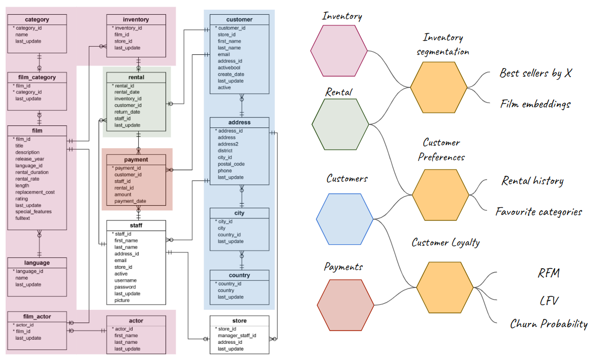

# dvdrental
DVD Reantal Demo

## Overview



## Building docker image
First of all we have to build docker image. We can do it by moving in `docker` folder and execute:
```docker
docker build -t dvdrental .
```
Docker will download all needed dependencies and build image with name "dvdrental". We can check it by execute:
```docker
docker images
```

## Running docker container
To run created image we have to execute "docker run" like this:
```docker
docker run -p 5433:5432 --name odm-demo-dvdrental --net host  dvdrental
```
Docker will run container with name "odm-demo-dvdrental", based on image "dvdrental" and it will expose containers port 5432 on localhost port 5433.


